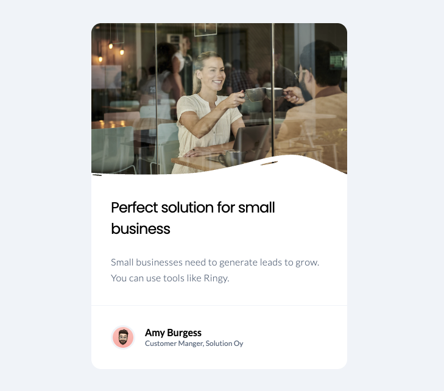

# Business Blog Card

This repository contains the "Business Blog Card" project, a front-end challenge focusing on creating a business-themed blog card using HTML and CSS.

    

## Technologies

-   **HTML:** Structuring the content of the blog card, including images and text.
-   **CSS:** Styling the blog card, enhanced with Google Fonts (Lato and Poppins). Key features include CSS variables for consistent styling, flexbox for layout management, and custom styling for responsive design.

## Features

-   Modern and clean UI with a focus on typography and layout.
-   Responsive design without the use of media queries.

## Setup

To view the project, clone the repository and open the `index.html` file in a web browser.
